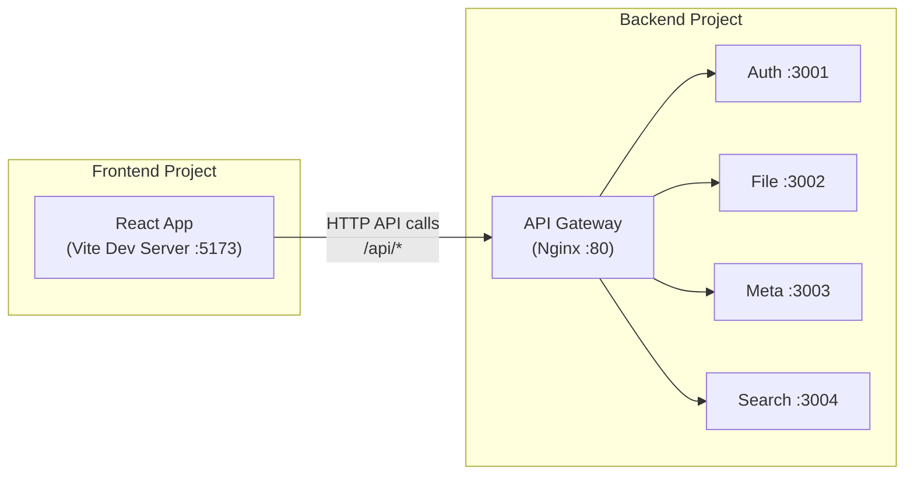
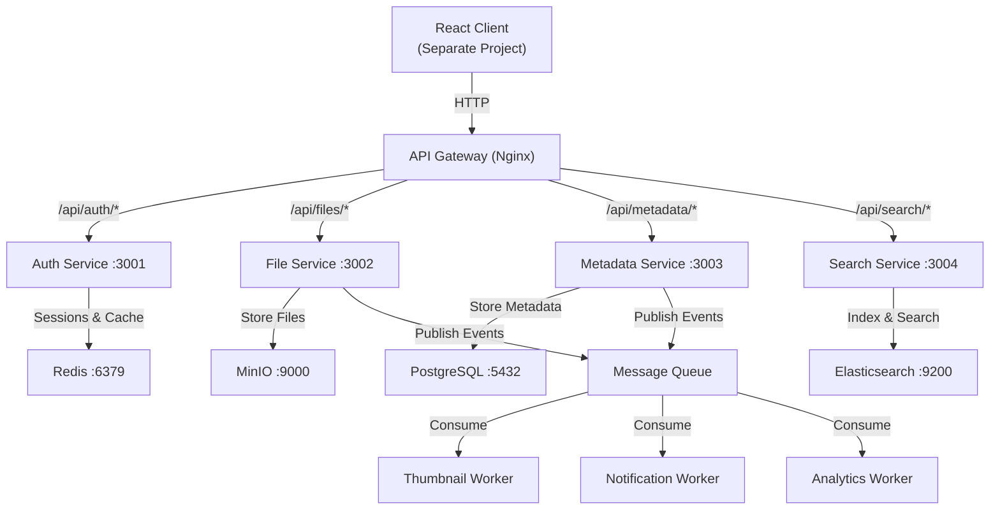

# Module 1: Project Foundation & Architecture Setup

## Goal

Set up the project foundation with **two separate projects** — a backend monorepo for all microservices and a standalone frontend app. This module creates the skeleton that all subsequent modules will build upon.

---

## Why Two Separate Projects?

| Reason | Explanation |
|---|---|
| **Independent Deployment** | Frontend deploys to CDN/Vercel, backend deploys to containers. Different release cycles. |
| **Team Scalability** | Frontend and backend teams work in separate repos without stepping on each other |
| **Different Build Pipelines** | Frontend uses Vite/Webpack, backend uses TypeScript compiler. Completely different toolchains. |
| **Deployment Flexibility** | Frontend is static files served from a CDN. Backend is containerized services. Mixing them forces compromises. |
| **Production Reality** | Google Drive, Dropbox, and most production systems separate frontend from backend |

> [!NOTE]
> **System Design Principle**: This is the **Backend for Frontend (BFF)** pattern. The frontend communicates with the backend exclusively through the API Gateway. Neither project knows about the other's internals — they share only an API contract.

---

## Project Structure

```
File Managment System/                 ← Your workspace root
├── backend/                           ← Backend monorepo (all microservices)
│   ├── apps/
│   │   ├── auth-service/              # Authentication & authorization
│   │   ├── file-service/              # File upload/download/management
│   │   ├── metadata-service/          # File metadata, folders, permissions
│   │   └── search-service/            # Search & indexing
│   ├── packages/
│   │   ├── shared-types/              # TypeScript interfaces shared across services
│   │   ├── shared-utils/              # Logger, error handling, response formatter
│   │   └── shared-config/             # Shared ESLint, TSConfig, Prettier
│   ├── workers/
│   │   ├── thumbnail-generator/       # Background: generate thumbnails
│   │   ├── notification-service/      # Background: send notifications
│   │   └── analytics-worker/          # Background: process events
│   ├── infrastructure/
│   │   ├── docker/                    # Dockerfiles for each service
│   │   ├── nginx/                     # Nginx API gateway config
│   │   └── scripts/                   # Setup and utility scripts
│   ├── docker-compose.yml             # Orchestrate all backend services
│   ├── docker-compose.dev.yml         # Development overrides
│   ├── package.json                   # Root workspace config
│   ├── turbo.json                     # Turborepo build orchestration
│   └── tsconfig.base.json             # Base TypeScript config
│
└── frontend/                          ← Standalone React app
    ├── src/
    │   ├── components/                # Reusable UI components
    │   ├── pages/                     # Page-level components
    │   ├── hooks/                     # Custom React hooks
    │   ├── services/                  # API client layer
    │   ├── store/                     # State management
    │   ├── types/                     # TypeScript interfaces (mirrors API contract)
    │   ├── utils/                     # Helper functions
    │   ├── styles/                    # Global styles and CSS
    │   ├── App.tsx
    │   └── main.tsx
    ├── public/                        # Static assets
    ├── package.json
    ├── tsconfig.json
    ├── vite.config.ts
    └── index.html
```

### How the Two Projects Connect



> [!TIP]
> **In development**, Vite's proxy feature forwards `/api/*` requests to the backend Nginx gateway. In production, both are deployed separately — frontend on a CDN, backend behind a load balancer.

---

## Architecture Overview (Backend)



---

## What Module 1 Will Create

### Phase 1: Backend Monorepo Setup
- Initialize the backend monorepo with `pnpm` workspaces
- Configure Turborepo for build orchestration
- Set up shared TypeScript, ESLint, and Prettier configs
- Create the complete folder structure

### Phase 2: Shared Packages
- **`shared-types`** — TypeScript interfaces for User, File, Folder, API responses
- **`shared-utils`** — Logger (Winston), error handler, response formatter
- **`shared-config`** — Shared `tsconfig.json`, `.eslintrc`, `.prettierrc`

### Phase 3: Service Scaffolding
- Create Express.js skeleton for each backend service (auth, file, metadata, search)
- Each service gets: health check endpoint, graceful shutdown, environment config
- **No business logic yet** — just the skeleton that boots and responds to `/health`

### Phase 4: Docker & Infrastructure
- Dockerfiles for each service (multi-stage builds)
- Docker Compose with all infrastructure (PostgreSQL, Redis, MinIO, Elasticsearch)
- Nginx configuration for API gateway routing
- Development overrides with hot reload

### Phase 5: Frontend Project Setup
- Initialize Vite + React + TypeScript project
- Set up folder structure, routing, and API client layer
- Configure Vite proxy to forward `/api/*` to backend
- Create a minimal shell UI (just the layout, no features yet)

---

## Proposed File List

### Backend — Root Configuration

| File | Purpose |
|---|---|
| `backend/package.json` | Root workspace config with pnpm workspaces |
| `backend/turbo.json` | Turborepo pipeline (build, dev, lint, test) |
| `backend/tsconfig.base.json` | Base TypeScript config for all services |
| `backend/.eslintrc.js` | Root ESLint rules |
| `backend/.prettierrc` | Formatting rules |
| `backend/.gitignore` | Ignore node_modules, dist, .env, etc. |
| `backend/.env.example` | Template environment variables |

### Backend — Shared Packages

| File | Purpose |
|---|---|
| `packages/shared-types/src/index.ts` | All shared interfaces: `IUser`, `IFile`, `IFolder`, `IApiResponse` |
| `packages/shared-utils/src/logger.ts` | Winston logger with JSON output |
| `packages/shared-utils/src/errors.ts` | Custom error classes (`AppError`, `NotFoundError`, etc.) |
| `packages/shared-utils/src/response.ts` | Standard API response formatter |

### Backend — Service Scaffolding (×4 services)

| File (per service) | Purpose |
|---|---|
| `apps/<service>/src/index.ts` | Express server entry point with graceful shutdown |
| `apps/<service>/src/config/index.ts` | Environment variable config with validation |
| `apps/<service>/src/routes/health.ts` | Health check route |
| `apps/<service>/package.json` | Service-specific dependencies |
| `apps/<service>/tsconfig.json` | Extends base tsconfig |
| `apps/<service>/.env.example` | Service-specific env template |

### Backend — Infrastructure

| File | Purpose |
|---|---|
| `docker-compose.yml` | All services + infrastructure |
| `docker-compose.dev.yml` | Dev overrides (volumes, debug ports) |
| `infrastructure/docker/Dockerfile.service` | Multi-stage Dockerfile for backend services |
| `infrastructure/nginx/nginx.conf` | API gateway routing config |
| `infrastructure/scripts/health-check.sh` | Script to verify all services |

### Frontend

| File | Purpose |
|---|---|
| `frontend/package.json` | React app dependencies |
| `frontend/vite.config.ts` | Vite config with API proxy |
| `frontend/tsconfig.json` | TypeScript config |
| `frontend/src/main.tsx` | React entry point |
| `frontend/src/App.tsx` | Root component with router |
| `frontend/src/services/api.ts` | Axios/fetch API client base |
| `frontend/src/types/index.ts` | API contract types (mirrors backend shared-types) |

---

## Dependencies

### Backend (Per Service)
| Package | Purpose |
|---|---|
| `express` | HTTP framework |
| `cors` | Cross-origin resource sharing |
| `helmet` | Security headers |
| `dotenv` | Environment variable loading |
| `compression` | Response compression |

### Backend (Shared Utils)
| Package | Purpose |
|---|---|
| `winston` | Structured logging |
| `uuid` | Request ID generation |

### Backend (Dev — Root)
| Package | Purpose |
|---|---|
| `typescript` | TypeScript compiler |
| `tsx` | TS execution with hot reload |
| `eslint` + plugins | Code linting |
| `prettier` | Code formatting |
| `turbo` | Monorepo build orchestration |
| `@types/node`, `@types/express` | Type definitions |

### Frontend
| Package | Purpose |
|---|---|
| `react`, `react-dom` | UI library |
| `react-router-dom` | Client-side routing |
| `axios` | HTTP client |
| `@tanstack/react-query` | Server state management |

---

## Verification Plan

### Backend Verification
```bash
# 1. Install all dependencies
cd backend && pnpm install

# 2. Build all packages
pnpm build

# 3. Lint all code  
pnpm lint

# 4. Start infrastructure with Docker
docker-compose up -d postgres redis minio

# 5. Start all services in dev mode
pnpm dev

# 6. Health checks
curl http://localhost:3001/health  # Auth
curl http://localhost:3002/health  # File
curl http://localhost:3003/health  # Metadata
curl http://localhost:3004/health  # Search

# 7. Test Nginx gateway routing
curl http://localhost/api/auth/health
curl http://localhost/api/files/health
```

### Frontend Verification
```bash
# 1. Install dependencies
cd frontend && npm install

# 2. Start dev server
npm run dev

# 3. Open http://localhost:5173 — should see the shell UI
# 4. API proxy should forward /api/* to backend
```

---

## System Design Concepts Covered

| Concept | Where It Appears |
|---|---|
| **Microservices Architecture** | Each backend service is independent, single-responsibility |
| **API Gateway Pattern** | Nginx routes all traffic, single entry point |
| **Backend for Frontend (BFF)** | Frontend and backend are separate, connected only by API |
| **Monorepo (Backend)** | Shared types prevent contract drift between services |
| **Infrastructure as Code** | Docker Compose defines the entire backend stack |
| **12-Factor App** | Environment-based config, stateless services |
| **Graceful Shutdown** | Services handle SIGTERM for zero-downtime deploys |
| **Structured Logging** | JSON logs with correlation IDs |
| **Health Checks** | Every service exposes `/health` for readiness probes |

---

## Common Mistakes to Avoid

1. **Hardcoding the backend URL in frontend** — Use environment variables and Vite proxy
2. **Duplicating types** — Frontend types should mirror the API contract, not copy-paste backend internals
3. **Putting business logic in this module** — Get the foundation right first
4. **Skipping graceful shutdown** — Kubernetes/Docker sends SIGTERM before killing containers
5. **Not configuring CORS properly** — Frontend and backend run on different ports/domains
6. **Using `ts-node` in production** — Always compile to JavaScript for production

---

## Module Roadmap

| Module | Description | Status |
|---|---|---|
| **1. Project Foundation** | Two-project setup, Docker, scaffolding | ← **This module** |
| 2. Authentication Service | Registration, login, JWT, RBAC | Next |
| 3. Database & ORM Setup | PostgreSQL, Prisma, migrations | Planned |
| 4. File Service | Upload, download, MinIO integration | Planned |
| 5. Metadata Service | File metadata, folders, permissions | Planned |
| 6. Search Service | Elasticsearch indexing and search | Planned |
| 7. Message Queue & Workers | RabbitMQ, thumbnails, notifications | Planned |
| 8. Caching Layer | Redis caching, sessions, rate limiting | Planned |
| 9. React Frontend | File explorer UI, upload/download | Planned |
| 10. Production Hardening | Monitoring, logging, security, CI/CD | Planned |

---

## Open Questions

> [!IMPORTANT]
> **Package Manager**: I recommend **pnpm** for the backend monorepo (fastest, best workspace support). The frontend can use **npm** or **pnpm** — your preference?

> [!IMPORTANT]
> **ORM Choice**: **Prisma** (modern, type-safe, great DX) or **TypeORM** (traditional, closer to raw SQL)? I recommend **Prisma**.

> [!IMPORTANT]
> **Message Queue**: **RabbitMQ** (simpler, great for learning) or **Kafka** (high throughput, more complex)? I recommend starting with **RabbitMQ**.

> [!NOTE]
> **Frontend**: I'll use **Vite + React + TypeScript** (no Next.js needed since this is a SPA, not SSR). Confirm?

Please review and confirm:
1. Your preferences on the open questions
2. Any changes to the two-project structure
3. Approval to begin implementation
