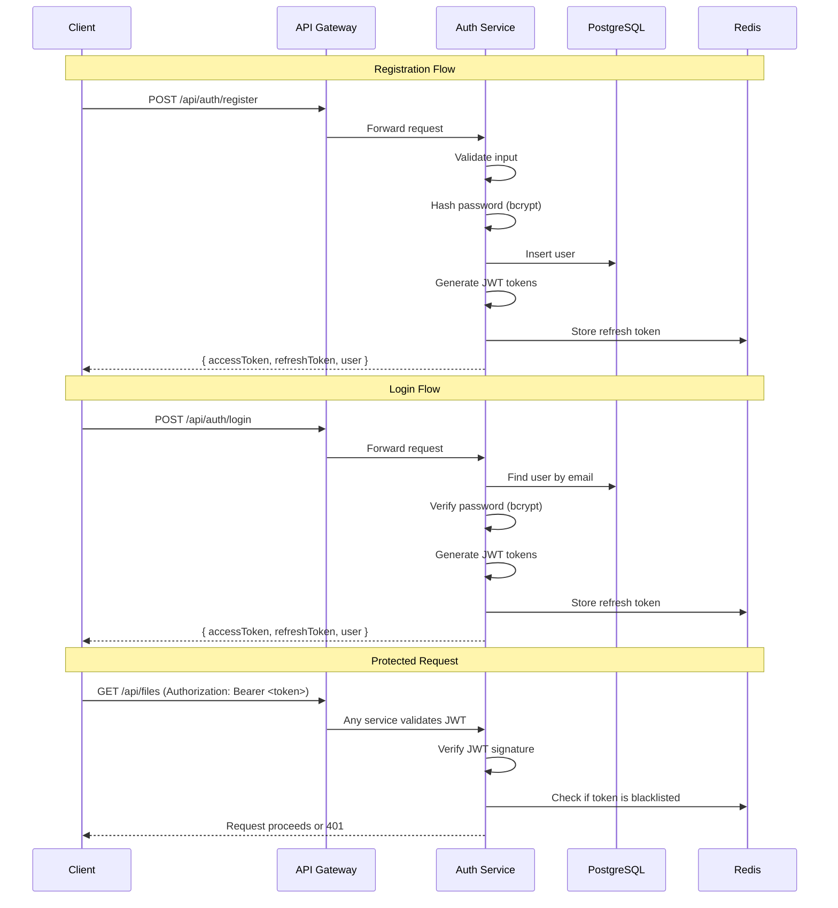

# Module 2: Authentication Service

## Goal

Build a complete authentication system with user registration, login, JWT tokens, and role-based access control (RBAC). This is the first service to receive business logic.

---

## Why Authentication First?

Every other service depends on knowing **who** is making the request:
- File Service needs to know who owns the file
- Metadata Service needs to check permissions
- Search Service needs to filter results by user access

> [!IMPORTANT]
> **System Design Principle: Auth is a cross-cutting concern.** In microservices, authentication is typically handled in one of two ways:
> 1. **Gateway-level auth** — The API gateway validates tokens before forwarding requests
> 2. **Service-level auth** — Each service validates tokens independently
>
> We'll use **service-level auth with shared middleware** — the JWT validation middleware lives in `shared-utils` so every service can use it, but each service validates tokens independently. This avoids a single point of failure.

---

## Architecture



---

## What Module 2 Will Create

### Phase 1: Database Setup (Prisma + PostgreSQL)
- Install Prisma ORM
- Create User schema with migrations
- Set up database connection
- Seed initial admin user

### Phase 2: User Registration
- Input validation (email, password strength, username)
- Password hashing with bcrypt (12 salt rounds)
- Duplicate email/username detection
- Return JWT tokens on successful registration

### Phase 3: Login & JWT Tokens
- Email + password authentication
- Access token (short-lived, 15 minutes)
- Refresh token (long-lived, 30 days, stored in Redis)
- Token payload: `{ userId, email, role }`

### Phase 4: JWT Middleware (Shared)
- Token extraction from `Authorization: Bearer <token>` header
- JWT signature verification
- Token expiration check
- Attach decoded user to `req.user`
- Blacklist check via Redis (for logout)

### Phase 5: Role-Based Access Control (RBAC)
- Role middleware: `authorize('admin')`, `authorize('user', 'admin')`
- Three roles: `admin`, `user`, `viewer`
- Protect routes by required role

### Phase 6: Token Refresh & Logout
- Refresh endpoint: exchange expired access token for new one
- Refresh token rotation (old refresh token invalidated)
- Logout: blacklist access token in Redis
- "Logout all devices": invalidate all refresh tokens for a user

---

## API Design

### POST `/api/auth/register`
```
Request:
{
  "email": "user@example.com",
  "username": "johndoe",
  "password": "SecurePass123!",
  "firstName": "John",
  "lastName": "Doe"
}

Response (201):
{
  "success": true,
  "data": {
    "user": { "id", "email", "username", "firstName", "lastName", "role" },
    "accessToken": "eyJhbGci...",
    "refreshToken": "eyJhbGci..."
  },
  "message": "Registration successful"
}
```

### POST `/api/auth/login`
```
Request:
{
  "email": "user@example.com",
  "password": "SecurePass123!"
}

Response (200):
{
  "success": true,
  "data": {
    "user": { "id", "email", "username", "role" },
    "accessToken": "eyJhbGci...",
    "refreshToken": "eyJhbGci..."
  }
}
```

### POST `/api/auth/refresh`
```
Request:
{
  "refreshToken": "eyJhbGci..."
}

Response (200):
{
  "success": true,
  "data": {
    "accessToken": "new-eyJhbGci...",
    "refreshToken": "new-eyJhbGci..."
  }
}
```

### POST `/api/auth/logout`
```
Headers: Authorization: Bearer <accessToken>

Response (200):
{
  "success": true,
  "message": "Logged out successfully"
}
```

### GET `/api/auth/me`
```
Headers: Authorization: Bearer <accessToken>

Response (200):
{
  "success": true,
  "data": { "id", "email", "username", "firstName", "lastName", "role", "storageUsed", "storageLimit" }
}
```

---

## Database Schema (Prisma)

```prisma
model User {
  id             String    @id @default(uuid())
  email          String    @unique
  username       String    @unique
  passwordHash   String
  firstName      String
  lastName       String
  avatarUrl      String?
  role           Role      @default(USER)
  storageUsed    BigInt    @default(0)
  storageLimit   BigInt    @default(5368709120) // 5GB
  isActive       Boolean   @default(true)
  lastLoginAt    DateTime?
  createdAt      DateTime  @default(now())
  updatedAt      DateTime  @updatedAt

  @@map("users")
}

enum Role {
  ADMIN
  USER
  VIEWER
}
```

> [!NOTE]
> **Why BigInt for storage?** — `5GB = 5,368,709,120 bytes`. A standard 32-bit integer maxes out at ~2.1GB. BigInt supports up to 9.2 exabytes, future-proofing the schema.

---

## Proposed File Changes

### Database (New shared package)

#### [NEW] packages/database/prisma/schema.prisma
Prisma schema with User model and Role enum.

#### [NEW] packages/database/src/index.ts
Prisma client singleton (connection pooling).

#### [NEW] packages/database/prisma/seed.ts
Seed script to create initial admin user.

---

### Auth Service (New files)

#### [NEW] apps/auth-service/src/routes/auth.routes.ts
Express router with register, login, refresh, logout, me endpoints.

#### [NEW] apps/auth-service/src/controllers/auth.controller.ts
Request handling — parse input, call service, return response.

#### [NEW] apps/auth-service/src/services/auth.service.ts
Business logic — hash passwords, generate tokens, validate credentials.

#### [NEW] apps/auth-service/src/validators/auth.validator.ts
Input validation using Zod schemas.

#### [MODIFY] apps/auth-service/src/index.ts
Register auth routes on the Express app.

#### [MODIFY] apps/auth-service/src/config/index.ts
Add database URL and Redis config.

#### [MODIFY] apps/auth-service/package.json
Add new dependencies (bcrypt, jsonwebtoken, zod, ioredis).

---

### Shared Utils (New middleware)

#### [NEW] packages/shared-utils/src/middleware/auth.middleware.ts
JWT verification middleware — validates token, attaches `req.user`.

#### [NEW] packages/shared-utils/src/middleware/rbac.middleware.ts
Role-based access middleware — `authorize('admin')`.

#### [MODIFY] packages/shared-utils/src/index.ts
Export new middleware.

---

## New Dependencies

### Auth Service
| Package | Purpose |
|---------|---------|
| `bcrypt` | Password hashing (industry standard, adaptive cost) |
| `jsonwebtoken` | JWT creation and verification |
| `zod` | Schema validation (type-safe, great error messages) |
| `ioredis` | Redis client for token blacklisting |
| `@file-manager/database` | Prisma client for database access |

### Database Package
| Package | Purpose |
|---------|---------|
| `prisma` | ORM — migrations, schema, query builder |
| `@prisma/client` | Auto-generated type-safe database client |

---

## Security Considerations

| Concern | How We Handle It |
|---------|-----------------|
| **Password Storage** | bcrypt with 12 salt rounds (never store plaintext) |
| **Token Theft** | Short-lived access tokens (15 min), refresh rotation |
| **Brute Force** | Rate limiting on login endpoint (via express-rate-limit) |
| **Token Replay** | Blacklist tokens on logout via Redis |
| **Timing Attacks** | bcrypt.compare is constant-time |
| **SQL Injection** | Prisma uses parameterized queries |
| **Input Validation** | Zod validates all input before processing |

---

## System Design Concepts in This Module

| Concept | Where It Appears |
|---------|-----------------|
| **JWT (JSON Web Tokens)** | Stateless authentication — no server-side session storage |
| **Access + Refresh Token Pattern** | Short-lived access (15min) + long-lived refresh (30d) for security |
| **Token Rotation** | Refresh token is single-use — if stolen, the real user's next refresh fails, triggering detection |
| **Password Hashing (bcrypt)** | Adaptive cost function — gets slower as hardware gets faster |
| **RBAC** | Role-based permissions checked via middleware |
| **Connection Pooling** | Prisma manages a pool of PostgreSQL connections |
| **Input Validation** | Zod schemas validate at the boundary (controller level) |
| **Separation of Concerns** | Controller → Service → Repository pattern |

---

## Verification Plan

### Automated Tests (curl)
```bash
# 1. Register a new user
curl -X POST http://localhost:3001/api/auth/register \
  -H "Content-Type: application/json" \
  -d '{"email":"test@test.com","username":"testuser","password":"Test123!","firstName":"Test","lastName":"User"}'

# 2. Login
curl -X POST http://localhost:3001/api/auth/login \
  -H "Content-Type: application/json" \
  -d '{"email":"test@test.com","password":"Test123!"}'

# 3. Access protected route
curl http://localhost:3001/api/auth/me \
  -H "Authorization: Bearer <token_from_login>"

# 4. Refresh token
curl -X POST http://localhost:3001/api/auth/refresh \
  -H "Content-Type: application/json" \
  -d '{"refreshToken":"<refresh_token>"}'

# 5. Logout
curl -X POST http://localhost:3001/api/auth/logout \
  -H "Authorization: Bearer <token>"

# 6. Verify token is blacklisted (should return 401)
curl http://localhost:3001/api/auth/me \
  -H "Authorization: Bearer <same_token_after_logout>"
```

### Prerequisites
- PostgreSQL running (`docker-compose up -d postgres`)
- Redis running (`docker-compose up -d redis`)

---

## Common Mistakes to Avoid

1. **Storing JWT secret in code** — Always use environment variables
2. **Not hashing passwords** — NEVER store plaintext passwords
3. **Long-lived access tokens** — Keep access tokens short (15 min max)
4. **Not validating input** — Every endpoint must validate before processing
5. **Returning password hash in responses** — Always exclude from API responses
6. **Single token approach** — Always use access + refresh token pair
7. **Not handling token expiration gracefully** — Frontend should auto-refresh

---

> [!NOTE]
> **Prerequisite**: Module 2 requires PostgreSQL and Redis running. We'll start them via Docker Compose before testing.

Please review and approve to begin implementation.
