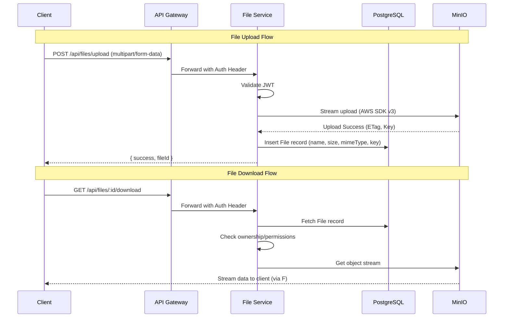

# Module 3: File Service & MinIO

## Goal
Build the File Service responsible for managing file uploads, downloads, and deletions. This service will integrate with MinIO (an S3-compatible object storage) to store the actual binary blobs, and use PostgreSQL (via Prisma) to keep track of file metadata.

---

## Architecture & Responsibilities



> [!IMPORTANT]
> **System Design Principle: Streaming** 
> We must NOT buffer the entire file in the Node.js memory. If 100 users upload a 1GB file simultaneously, it would crash the server (OOM). We will use `multer` to process the multipart stream and pipe it directly to MinIO using `@aws-sdk/lib-storage`.

---

## What We Will Build

### Phase 1: Database Updates
- Update the Prisma schema in `@file-manager/database` to add a `File` model.
- Add relationships: `User` -> `File` (Owner).
- Run Prisma migrations.

### Phase 2: MinIO Setup & AWS SDK
- Start the MinIO container via Docker Compose.
- Create a script to ensure the `file-storage` bucket exists on startup.
- Setup `@aws-sdk/client-s3` in the File Service to communicate with MinIO.

### Phase 3: File Service Implementation
- **Dependencies**: Install `multer`, `@aws-sdk/client-s3`, `@aws-sdk/lib-storage`, `mime-types`.
- **Controllers/Routes**:
  - `POST /api/files/upload`: Handles multipart form data.
  - `GET /api/files/:id/download`: Streams the file back.
  - `DELETE /api/files/:id`: Deletes from MinIO and Database.
- **Service Layer**: Handles S3 interactions and Database transactions.

---

## Database Schema (Prisma) Update

```prisma
model File {
  id           String   @id @default(uuid())
  originalName String   @map("original_name")
  storageKey   String   @unique @map("storage_key") // The path in MinIO
  mimeType     String   @map("mime_type")
  size         BigInt   
  
  ownerId      String   @map("owner_id")
  owner        User     @relation(fields: [ownerId], references: [id])
  
  createdAt    DateTime @default(now()) @map("created_at")
  updatedAt    DateTime @updatedAt @map("updated_at")

  @@index([ownerId])
  @@map("files")
}
```
*(The `User` model will be updated with a `files File[]` field).*

---

## API Design

### POST `/api/files/upload`
**Content-Type**: `multipart/form-data`
**Payload**: `file` (binary)
```json
// Response (201)
{
  "success": true,
  "data": {
    "id": "abc-123",
    "originalName": "report.pdf",
    "size": 1048576,
    "mimeType": "application/pdf"
  }
}
```

### GET `/api/files/:id/download`
Returns the raw binary stream with appropriate `Content-Disposition` and `Content-Type` headers so the browser downloads it correctly.

### DELETE `/api/files/:id`
```json
// Response (200)
{
  "success": true,
  "message": "File deleted successfully"
}
```

---

## Security & Edge Cases Handled
- **Ownership Verification**: Users can only download or delete their own files.
- **Stream Error Handling**: If an upload stream fails halfway, MinIO aborts the multipart upload, and we avoid creating a dangling DB record.
- **File Name Sanitization**: We store the original file name, but we use a random UUID + original extension for the `storageKey` in MinIO to prevent directory traversal and name collisions.

---

## Open Questions for You

> [!WARNING]  
> Are you okay with starting the MinIO container on ports `9000` (API) and `9001` (Console)?
> If you have another local application using these ports, please let me know so we can adjust the `.env`.

Please approve this plan so we can begin implementation!
