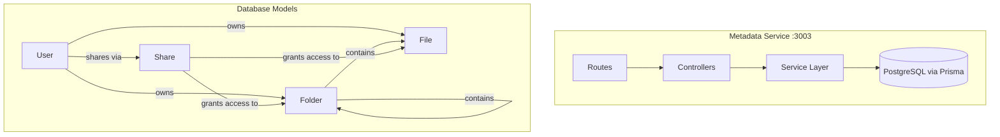

# Module 4: Metadata Service — Folders, Hierarchy & Sharing

## Goal

Build the Metadata Service responsible for organizing files into a **folder hierarchy** (like Google Drive) and managing **file sharing & permissions** between users.

Currently, our `File` model is flat — every file lives at the root level. This module adds the tree structure and access control that makes a file management system actually usable.

---

## Architecture



> [!IMPORTANT]
> **System Design Concept: Adjacency List for Tree Structures**
> 
> We model folders as an **adjacency list** — each folder has a `parentId` pointing to its parent folder. `parentId = null` means it's a root-level folder.
>
> **Why not Nested Sets or Materialized Paths?**
> - Adjacency list is simplest and best for **frequent writes** (create/move/delete folders)
> - Nested sets are better for read-heavy trees but very expensive on writes
> - We can add a `path` column later for faster breadcrumb queries if needed

---

## Database Schema Changes

### New Models

```prisma
model Folder {
  id        String   @id @default(uuid())
  name      String
  parentId  String?  @map("parent_id")
  ownerId   String   @map("owner_id")

  parent    Folder?  @relation("FolderTree", fields: [parentId], references: [id])
  children  Folder[] @relation("FolderTree")
  owner     User     @relation(fields: [ownerId], references: [id])
  files     File[]

  createdAt DateTime @default(now()) @map("created_at")
  updatedAt DateTime @updatedAt @map("updated_at")

  @@unique([name, parentId, ownerId])  // No duplicate folder names in same location
  @@index([ownerId])
  @@index([parentId])
  @@map("folders")
}

model Share {
  id           String          @id @default(uuid())
  permission   SharePermission @default(VIEWER)
  
  sharedById   String          @map("shared_by_id")
  sharedWithId String          @map("shared_with_id")
  fileId       String?         @map("file_id")
  folderId     String?         @map("folder_id")

  sharedBy     User            @relation("SharedByUser", fields: [sharedById], references: [id])
  sharedWith   User            @relation("SharedWithUser", fields: [sharedWithId], references: [id])
  file         File?           @relation(fields: [fileId], references: [id])
  folder       Folder?         @relation(fields: [folderId], references: [id])

  createdAt    DateTime        @default(now()) @map("created_at")

  @@unique([sharedWithId, fileId])
  @@unique([sharedWithId, folderId])
  @@map("shares")
}

enum SharePermission {
  VIEWER   // Can view/download
  EDITOR   // Can view/download/rename
}
```

### Updates to Existing Models
- **File**: Add optional `folderId` field (null = root level)
- **User**: Add `folders`, `sharedByMe`, `sharedWithMe` relations

---

## API Endpoints

### Folder Management
| Method | Endpoint | Description |
|--------|----------|-------------|
| POST | `/api/metadata/folders` | Create a new folder |
| GET | `/api/metadata/folders/:id` | Get folder details + children |
| GET | `/api/metadata/folders/:id/contents` | List files and subfolders |
| PATCH | `/api/metadata/folders/:id` | Rename a folder |
| DELETE | `/api/metadata/folders/:id` | Delete folder (and contents) |
| POST | `/api/metadata/folders/:id/move` | Move folder to another parent |

### File Metadata
| Method | Endpoint | Description |
|--------|----------|-------------|
| GET | `/api/metadata/files` | List user's files (root level) |
| GET | `/api/metadata/files/:id` | Get file metadata |
| PATCH | `/api/metadata/files/:id` | Rename/move file to folder |

### Sharing
| Method | Endpoint | Description |
|--------|----------|-------------|
| POST | `/api/metadata/share` | Share a file/folder with another user |
| GET | `/api/metadata/shared-with-me` | List items shared with current user |
| DELETE | `/api/metadata/share/:id` | Revoke a share |

---

## Implementation Phases

### Phase 1: Schema Updates
- Add `Folder`, `Share` models and `SharePermission` enum to Prisma
- Add `folderId` to `File` model
- Update `User` model with new relations
- Run `prisma db push`

### Phase 2: Folder CRUD
- Service layer for create, get, list contents, rename, delete, move
- Controllers and routes
- Recursive delete (folder + all children + files)

### Phase 3: File Metadata Management
- List files at root or in a folder
- Rename a file
- Move a file to a different folder

### Phase 4: Sharing & Permissions
- Share a file/folder with another user (by email)
- List "Shared with me" items
- Revoke a share
- Permission checks in folder/file access

---

## Security Considerations

- **Ownership verification**: Users can only manage their own folders/files
- **Recursive permissions**: Sharing a folder grants access to all files within it
- **Circular dependency prevention**: Moving a folder into its own descendant is blocked
- **Cascade deletes**: Deleting a folder removes all subfolders, files, and associated shares

---

Please approve this plan to begin implementation!
