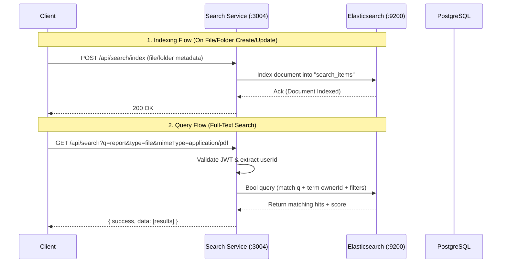

# Module 5: Search Service — Elasticsearch & Full-Text Search

## Goal

Build the **Search Service** responsible for high-performance full-text search, fuzzy matching, auto-suggestions, and metadata filtering across files and folders using **Elasticsearch**.

As the system grows to millions of files, database `LIKE '%query%'` queries become slow, unindexed, and scale poorly. Elasticsearch provides an inverted index with sub-millisecond query performance, relevance scoring, and typo tolerance.

---

## Architecture & Data Flow



> [!IMPORTANT]
> **System Design Concept: Multi-Tenant Data Isolation in Search**
> 
> Elasticsearch stores all documents in a shared index `search_items`. To enforce strict security:
> - Every query **must** contain a filter clause: `term: { ownerId: currentUserId }` (or shared permissions).
> - Users will **never** see search results belonging to other users.

---

## Elasticsearch Index Mapping (`search_items`)

```json
{
  "mappings": {
    "properties": {
      "id": { "type": "keyword" },
      "itemType": { "type": "keyword" },
      "name": {
        "type": "text",
        "fields": {
          "keyword": { "type": "keyword" },
          "completion": { "type": "completion" }
        }
      },
      "ownerId": { "type": "keyword" },
      "mimeType": { "type": "keyword" },
      "size": { "type": "long" },
      "folderId": { "type": "keyword" },
      "createdAt": { "type": "date" },
      "updatedAt": { "type": "date" }
    }
  }
}
```

---

## API Endpoints

### 1. Indexing Endpoints (Internal / Admin / Synced)
| Method | Endpoint | Description |
|--------|----------|-------------|
| POST | `/api/search/index` | Upsert a file/folder into the search index |
| DELETE | `/api/search/index/:id` | Remove a document from the search index |
| POST | `/api/search/reindex` | Sync all DB records into Elasticsearch (Full Reindex) |

### 2. Search & Suggest Endpoints (Client Facing)
| Method | Endpoint | Query Parameters | Description |
|--------|----------|------------------|-------------|
| GET | `/api/search` | `q`, `itemType`, `mimeType`, `limit`, `offset` | Full-text search with fuzzy matching & filters |
| GET | `/api/search/suggest` | `q` | Real-time prefix auto-complete suggestions |

---

## Implementation Phases

### Phase 1: Infrastructure & Package Setup
- Start `fm-elasticsearch` Docker container (Port 9200)
- Install `@elastic/elasticsearch` client in `apps/search-service`
- Configure `search-service` config with `ELASTICSEARCH_URL` & JWT secret

### Phase 2: Index Initialization & Client Setup
- Implement `elastic.service.ts` to manage client connection, health check, and index setup
- Create `search_items` index with custom mappings on startup if it doesn't exist

### Phase 3: Indexing Logic & Sync
- Implement `indexItem(item)` and `deleteItem(id)` in search service
- Implement `POST /api/search/reindex` to populate Elasticsearch from PostgreSQL

### Phase 4: Full-Text Search & Auto-Suggest
- Implement multi-match queries with fuzzy matching (`fuzziness: "AUTO"`)
- Implement prefix/completion suggestions for instant search UI dropdowns
- Create controllers and routes with JWT authentication middleware

### Phase 5: Verification & E2E Testing
- Verify Elasticsearch container health check
- Test indexing files & folders
- Test full-text search with exact and fuzzy queries
- Verify multi-tenant security boundary (User A cannot search User B's files)
- Test auto-suggest dropdown endpoint

---

Please review and approve this implementation plan!
