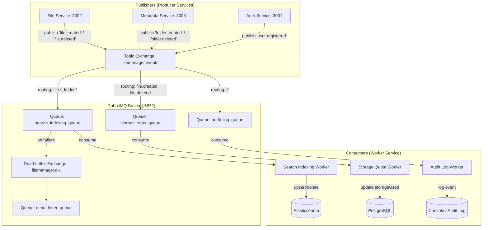

# Module 6: Message Queue & Workers — RabbitMQ Event-Driven Architecture

## Goal

Build an **Asynchronous Event-Driven Architecture** using **RabbitMQ** to decouple microservices, offload heavy background tasks, and handle system events asynchronously.

Currently, file uploads and metadata changes are processed synchronously. With RabbitMQ, services publish events (e.g., `file.created`, `file.deleted`), and background workers consume these events to perform indexing, audit logging, and storage accounting without blocking HTTP responses.

---

## Architecture & Topology



> [!IMPORTANT]
> **System Design Concept: Asynchronous Decoupling & Dead Letter Queues**
> 
> - **Publisher Non-blocking**: When a file is uploaded, `file-service` returns HTTP 201 immediately after saving to MinIO/DB, then emits a `file.created` event.
> - **At-Least-Once Delivery**: Messages require manual acknowledgment (`channel.ack(msg)`). If a worker crashes, RabbitMQ re-queues the message.
> - **Dead Letter Queue (DLQ)**: If a message fails processing after max retries, it is routed to `filemanager.dlq` for manual inspection rather than poisoning the queue.

---

## Message Schemas & Routing Keys

### Routing Key: `file.created`
```json
{
  "eventId": "uuid",
  "eventType": "FILE_CREATED",
  "timestamp": "2026-08-08T12:00:00.000Z",
  "payload": {
    "fileId": "uuid",
    "originalName": "report.pdf",
    "storageKey": "userId/uuid.pdf",
    "mimeType": "application/pdf",
    "size": 1048576,
    "ownerId": "uuid",
    "folderId": null
  }
}
```

### Routing Key: `file.deleted`
```json
{
  "eventId": "uuid",
  "eventType": "FILE_DELETED",
  "timestamp": "2026-08-08T12:00:00.000Z",
  "payload": {
    "fileId": "uuid",
    "ownerId": "uuid",
    "size": 1048576
  }
}
```

---

## Implementation Plan

### Phase 1: Infrastructure & Shared AMQP Utilities
- Start `fm-rabbitmq` container (`rabbitmq:3-management-alpine` on ports 5672 / 15672)
- Install `amqplib` and `@types/amqplib` in `@file-manager/shared-utils`
- Build a resilient RabbitMQ publisher helper (`RabbitMQClient`) with auto-reconnect logic

### Phase 2: Create `worker-service` App
- Create `apps/worker-service` monorepo workspace package
- Setup RabbitMQ topology (Exchange: `filemanager.events`, Queues: `search_indexing_queue`, `storage_stats_queue`, `audit_log_queue`, and DLX)
- Implement consumers & message handlers:
  - **Search Worker**: Calls `elasticService.indexDocument()` or `deleteDocument()`
  - **Storage Worker**: Recalculates user storage in DB
  - **Audit Worker**: Logs structured event metrics

### Phase 3: Integrate Producers into Microservices
- Update `file-service` to publish `file.created` and `file.deleted` events
- Update `metadata-service` to publish `folder.created` and `folder.deleted` events

### Phase 4: Verification & E2E Testing
- Verify RabbitMQ Management UI (`http://localhost:15672`)
- Test publishing `file.created` event -> verify Search Service automatically indexes the file into Elasticsearch
- Test publishing `file.deleted` event -> verify file is auto-removed from Elasticsearch
- Test Dead Letter Queue (DLQ) behavior on invalid messages

---

Please review and approve this implementation plan!
