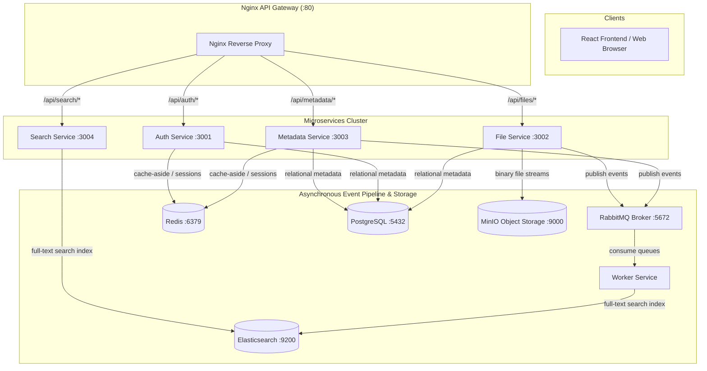

# Module 9: Production Hardening & Nginx API Gateway (FINAL MODULE)

## Goal

Finalize the File Management System architecture with **Production Hardening** and **Nginx API Gateway Integration**.

In a production microservice architecture, clients do not interact with individual service ports directly. Instead, all requests pass through **Nginx (Port 80)**, which acts as a reverse proxy, load balancer, and API gateway. Additionally, microservices must enforce security headers (Helmet), CORS lockdown, and graceful shutdown handling.

---

## Final System Architecture Overview

---

## Production Hardening Features

### 1. Nginx API Gateway (Port 80)
- Single entry point for all API calls: `http://localhost/api/*`
- Automatic HTTP header forwarding (`X-Real-IP`, `X-Forwarded-For`, `X-Request-ID`)
- Long timeout settings (`300s`) for large streaming file uploads

### 2. Security Hardening
- **Helmet HTTP Headers**: Configured across all microservices via `shared-utils`:
  - `X-Content-Type-Options: nosniff`
  - `X-Frame-Options: SAMEORIGIN`
  - `Strict-Transport-Security: max-age=15552000`
- **CORS Lockdown**: Only allow requests from configured frontend origins
- **Centralized Error Handling**: Ensures stack traces are hidden in production (`NODE_ENV=production`)

### 3. Graceful Shutdown & Draining
- Capture `SIGTERM` and `SIGINT` signals across node services to stop accepting new requests, drain active HTTP connections, and close PostgreSQL / Redis / RabbitMQ connections cleanly.

---

## Implementation Plan

### Phase 1: Shared Security & Graceful Shutdown Utilities
- Verify and enhance `shared-utils/src/app.ts` with Helmet security headers and SIGTERM/SIGINT signal listeners.

### Phase 2: Nginx Reverse Proxy Setup & Verification
- Start `fm-nginx` container using `docker-compose up -d nginx`
- Verify gateway health endpoint: `GET http://localhost/health`
- Verify reverse proxy routes (`/api/auth`, `/api/files`, `/api/metadata`, `/api/search`) through Nginx port 80

### Phase 3: Final System-Wide End-to-End Verification
- Run a full E2E test scenario against **Nginx (Port 80)**:
  1. Register & Login user via `http://localhost/api/auth/login`
  2. Create folder via `http://localhost/api/metadata/folders`
  3. Upload file via `http://localhost/api/files/upload` (emits `file.created` to RabbitMQ)
  4. Search file via `http://localhost/api/search?q=query` (served by Elasticsearch & Redis)
  5. Delete file via `http://localhost/api/files/:id`
- Confirm all 8 containers operate in complete harmony!

---

Please review and approve this final implementation plan!
